# Module 5: Data Archiving

In this module you'll create an Amazon Kinesis Firehose to deliver data from the Amazon Kinesis Stream created in the [Real-time Data Streaming Module][streaming-data-module] to Amazon Simple Storage Service (S3) in batches. We'll then use Amazon Athena to run queries against our raw data in place.

## Architecture Overview

The architecture for this module builds on the Amazon Kinesis Stream you created in the [Streaming Data Module][streaming-data-module] and introduces an AWS Lambda function to send data to an Amazon Kinesis Firehose. Firehose will batch the data and deliver it to Amazon S3. Finally, you'll use Amazon Athena to run ad-hoc queries against the data in the Amazon S3 bucket.

<kbd></kbd>

Our producer is a sensor attached to a unicorn - Shadowfax - currently taking a passenger on a Wild Ryde. This sensor emits data every second including the unicorn's current location, distance traveled in the previous second, and magic points and hit points so that our operations team can monitor the health of our unicorns from Wild Rydes headquarters. For this module, we'll use a command-line utility to produce these data points.

You'll build an AWS Lambda function to read from the stream and batch data into an Amazon Kinesis Firehose delivery stream. Every few minutes, Firehose will deliver the batched data to an Amazon S3 bucket where it can be stored indefinitely for future reprocessing. Using Amazon Athena, we'll run ad-hoc queries against our raw data.

Before beginning the module ensure that you have the Kinesis command-line clients downloaded by following the [installation instructions][client-installation].

## Implementation Instructions

### 1. Create an Amazon S3 bucket

Use the console or CLI to create an S3 bucket. Keep in mind, your bucket's name must be globally unique. We recommend using a name like `wildrydes-data-yourname`.

When selecting a region for your bucket, make sure it supports all of the services used in this module: AWS Lambda, Amazon Kinesis Streams, Amazon Kinesis Firehose, and Amazon Athena. Regions that support all of these services include US East (N. Virginia) and US West (Oregon).

<details>
<summary><strong>Step-by-step instructions (expand for details)</strong></summary><p>

1. From the AWS Console click **Services** then select **S3** under Storage.

1. Click **+Create Bucket**

1. Provide a globally unique name for your bucket such as `wildrydes-data-yourname`.

1. Select a region for your bucket.

    <kbd>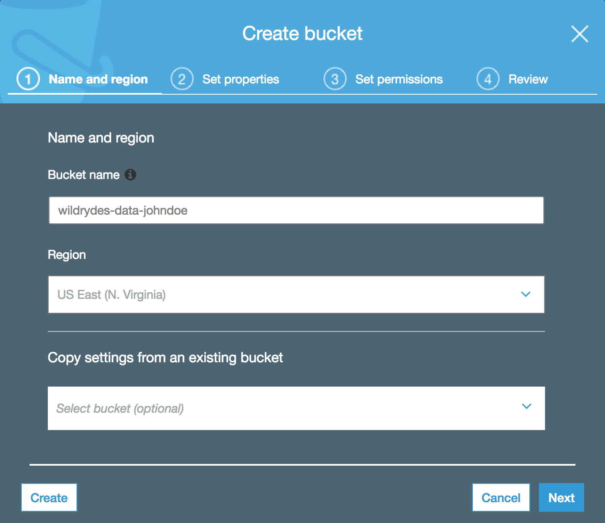</kbd>

1. Use the default values and click **Next** through the rest of the sections and click **Create Bucket** on the review section.

</p></details>

### 2. Create an Amazon Kinesis Firehose

Create an Amazon Kinesis Firehose delivery stream named **wildrydes** that is configured to deliver batched data to the S3 bucket created in the previous section.

<details>
<summary><strong>Step-by-step instructions (expand for details)</strong></summary><p>

1. From the AWS Console click **Services** then select **Kinesis** under Analytics.

1. Click **Go to the Firehose console**.

1. Click **Create Delivery Stream**.

1. Enter `wildrydes` into **Delivery stream name**

1. In "Source", select **Direct PUT or other sources**

	<kbd>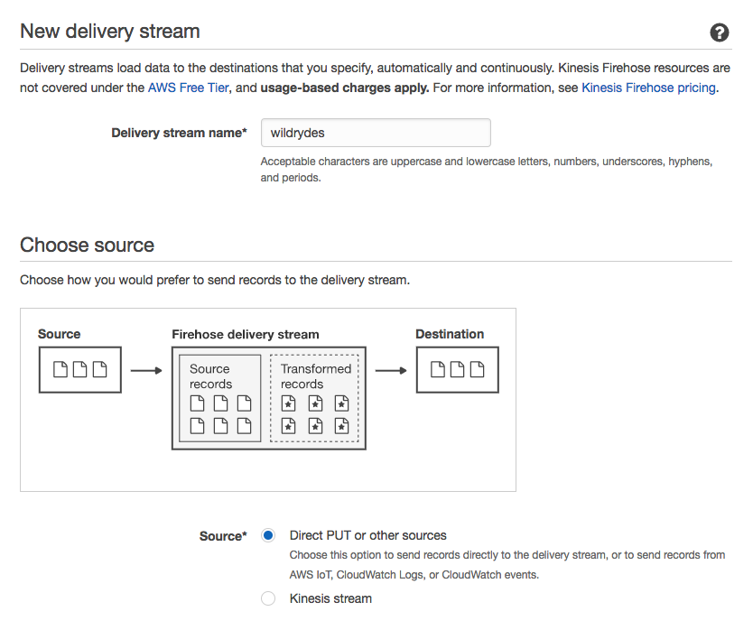</kbd>

1. Click "Next"

1. Click "Next" with "Disabled" being selected

	<kbd></kbd>

1. Select **Amazon S3** from **Destination**, and select the name of the bucket you created in the previous section from **S3 bucket**. Click **Next**.

	<kbd>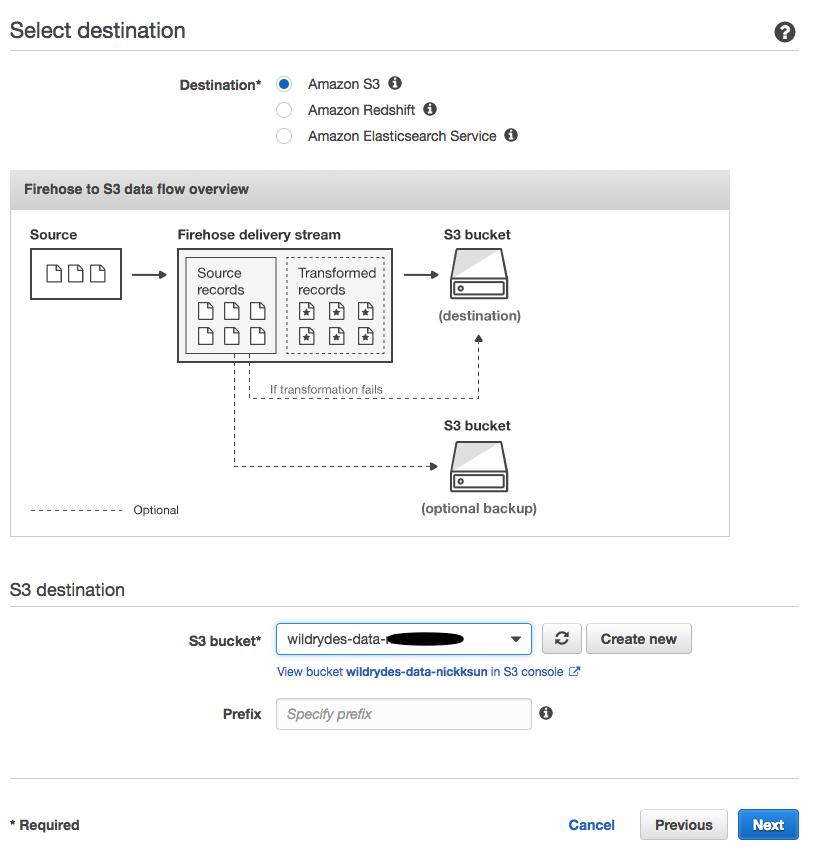</kbd>

1. Enter `60` into **Buffer interval** under **S3 Buffer** to set the frequency of S3 deliveries to once per minute.

	<kbd>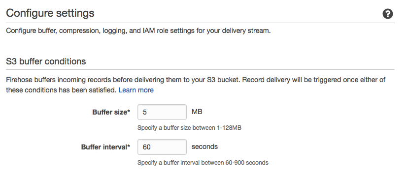</kbd>

1. Scroll down to the bottom of the page and click **Create new, or Choose** button from **IAM role**. This will walk you through the steps needed to create a new role for Firehose.

1. Click **Allow**, click **Next**, and then click **Create Delivery Stream**.

	<kbd>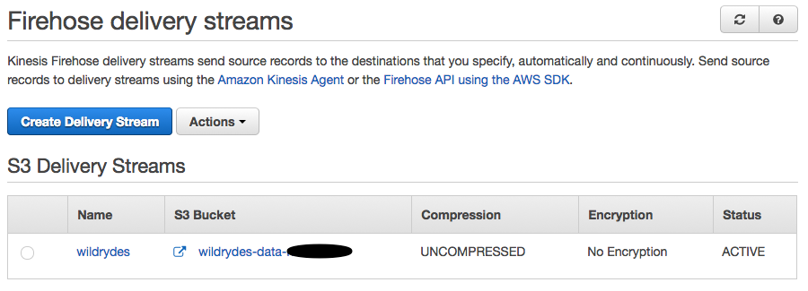</kbd>

</p></details>

### 3. Create an IAM role for your Lambda function

Use the IAM console to create a new role. Give it a name like `WildRydesLambdaKinesisRole` and select AWS Lambda for the role type. Attach the managed policy called `AWSLambdaKinesisExecutionRole` to this role in order to grant permissions for your function to read from Amazon Kinesis streams and to log to Amazon CloudWatch Logs.

Create an inline policy allowing the role access to the `firehose:PutRecordBatch` action for the Amazon Kinesis Firehose delivery stream you created in the previous section.

<details>
<summary><strong>Step-by-step instructions (expand for details)</strong></summary><p>

1. From the AWS Console, click on **Services** and then select **IAM** in the Security, Identity & Compliance section.

1. Select **Roles** from the left navigation and then click **Create new role**.

1. Select **Lambda** for the role type from **AWS Service Role**, then click **Next: Permissions**

    **Note:** Selecting a role type automatically creates a trust policy for your role that allows AWS services to assume this role on your behalf. If you were creating this role using the CLI, AWS CloudFormation or another mechanism, you would specify a trust policy directly.

1. Begin typing `AWSLambdaKinesisExecutionRole ` in the **Filter** text box and check the box next to that role.

1. Click **Next: Review**.

1. Enter `WildRydesLambdaKinesisRole` for the **Role Name**.

1. Click **Create role**.

1. Type `WildRydesLambdaKinesisRole` into the filter box on the Roles page and click the role you just created.

1. On the Permissions tab, click **Add inline policy** link to create a new inline policy.
	<kbd></kbd>

1. Ensure **Policy Generator** is selected and click **Select**.

1. Select **Amazon Kinesis Firehose** from the **AWS Service** dropdown.

1. Select **PutRecordBatch** from the Actions list.

1. Type the ARN of the delivery stream you created in the previous section in the **Amazon Resource Name (ARN)** field. The ARN is in the format of:

	```
	arn:aws:firehose:REGION:ACCOUNT_ID:deliverystream/wildrydes
	```

	For example, if you've deployed to US East (N. Virginia) and your account ID is 123456789012, your delivery stream ARN would be:

	```
	arn:aws:firehose:us-east-1:123456789012:deliverystream/wildrydes
	```

	To find your AWS account ID number in the AWS Management Console, click on **Support** in the navigation bar in the upper-right, and then click **Support Center**. Your currently signed in account ID appears in the upper-right corner below the Support menu.

    <kbd>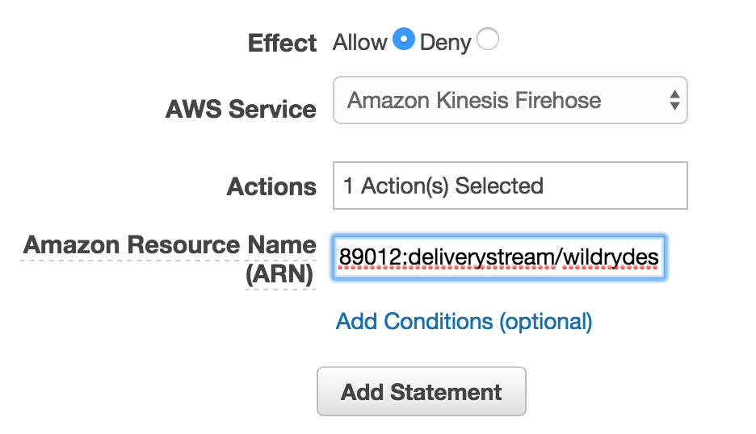</kbd>

1. Click **Add Statement**.

    <kbd></kbd>

1. Click **Next Step** then **Apply Policy**.

</p></details>

### 4. Create a Lambda function for batching data

Use the console to create a new Lambda function called `WildRydesStreamToFirehose` that will read from the Amazon Kinesis stream and batch records into the Amazon Kinesis Firehose delivery stream. Configure the Lambda function with a Kinesis trigger to process the **wildrydes** stream.

Use the provided [index.js](lambda/WildRydesStreamToFirehose/index.js) example implementation for your function code by copying and pasting the contents of that file into the Lambda console's editor. Ensure you create an environment variable with the key **DELIVERY\_STREAM\_NAME** and with the value **wildrydes**.

Make sure you configure your function to use the `WildRydesLambdaKinesisRole` IAM role you created in the previous section.

<details>
<summary><strong>Step-by-step instructions (expand for details)</strong></summary><p>

1. Click on **Services** then select **Lambda** in the Compute section.

1. Click **Create function**.

1. Click on **Author from scratch**.

1. Enter `WildRydesStreamToFirehose` in the **Name** field.

1. Select `WildRydesLambdaKinesisRole` from the **Existing Role** dropdown.

	<kbd>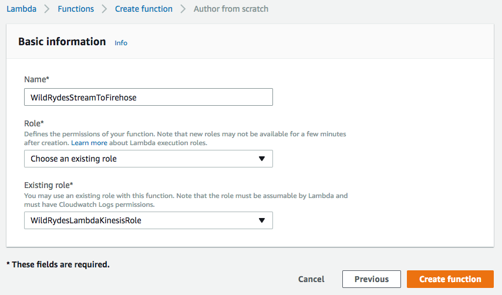</kbd>

1. Click on **Create function**.

1. Click on **Triggers** then click **+ Add trigger**

1. Click on the dotted outline and select **Kinesis**. Select **wildrydes** from **Kinesis stream**, **Trim horizon** from **Starting position**, and tick the **Enable trigger** checkbox.

	<kbd>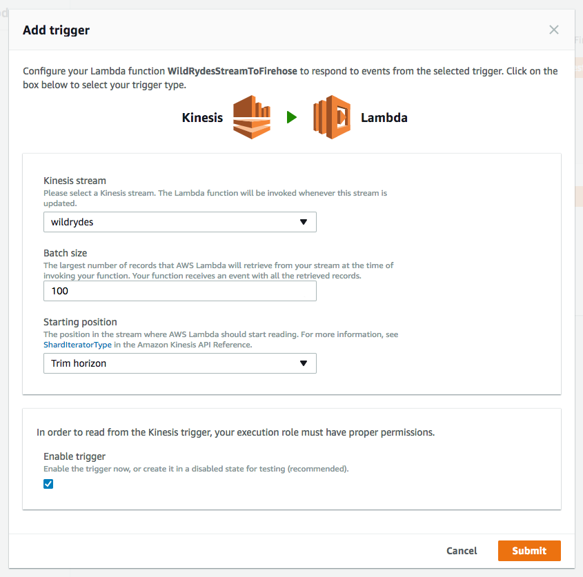</kbd>

    Starting position refers to the position in the stream where AWS Lambda should start reading and trim horizon configures this to the oldest data record in the shard. See [ShardIteratorType][shard-iterator-type-documentation] in the Amazon Kinesis API Reference for more details.

1. Click **Submit**.

1. Click **Configuration**.

1. Select **Node.js 6.10** for the **Runtime**.

1. Leave the default of `index.handler` for the **Handler** field.

1. Copy and paste the code from [index.js](lambda/WildRydesStreamToFirehose/index.js) into the code entry area.

	<kbd>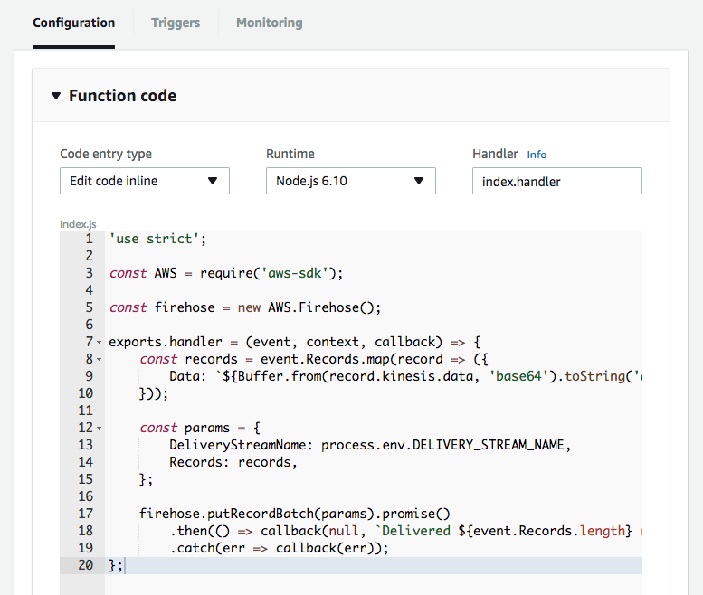</kbd>

1. Extend **Environment variables** under the entry area

1. In **Environment variables**, enter an environment variable with key `DELIVERY_STREAM_NAME` and value `wildrydes`.
	<kbd>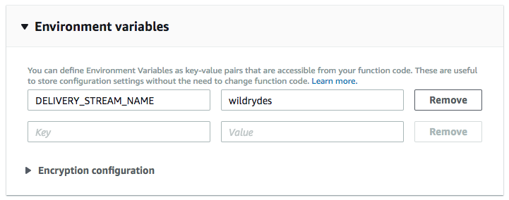</kbd>

1. Optionally enter a description under Timeout.

1. Scroll to top and click **"Save"** (**Not** "Save and test" since we haven't configured any test event)

1. Click on **Triggers** 

1. **Last processing result** on the trigger status screen will transition from **No records processed** to **OK** within a minute or so:

	<kbd>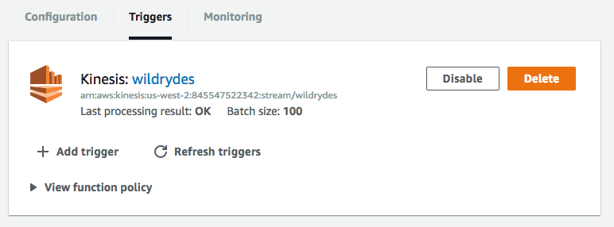</kbd>

    Click **Refresh triggers** every minute or so until you see **OK**.

</p></details>

### 5. Create an Amazon Athena table

Create an Amazon Athena table to query the raw data in place on Amazon S3 using a JSON SerDe. Name the table **wildrydes** and include the attributes in the raw data:

- **Name** (string)
- **StatusTime** (timestamp)
- **Latitude** (float)
- **Longitude** (float)
- **Distance** (int)
- **MagicPoints** (int)
- **HealthPoints** (int)

<details>
<summary><strong>Step-by-step instructions (expand for details)</strong></summary><p>

1. Click on **Services** then select **Athena** in the Analytics section.

1. Click "Get Started" if you see

1. Copy and paste the following SQL statement to create the table. Be sure to replace the bucket name with your bucket name in the LOCATION clause:

	```sql
	CREATE EXTERNAL TABLE IF NOT EXISTS wildrydes (
       Name string,
       StatusTime timestamp,
       Latitude float,
       Longitude float,
       Distance int,
       HealthPoints int,
       MagicPoints int
     )
     ROW FORMAT SERDE 'org.apache.hive.hcatalog.data.JsonSerDe'
     LOCATION 's3://wildrydes-data-johndoe/';
	```

1. Click **Run query**.

1. Verify the table **wildrydes** was created by ensuring it has been added to the list of tables in the left navigation, also record which database your table has been created in.

</p></details>

## Implementation Validation

1. Click on **Services** then select **S3** in the Storage section.

1. Enter the bucket name you create in the first section in the **Search for buckets** text input.

1. Click on the bucket name and navigate through the year, month, day, and hour folders to ensure that files are being populated in your bucket.

    <kbd></kbd>

1. Click on **Services** then select **Athena** in the Analytics section.

1. Ensure to select the database from left navigation where *wildrydes* table was created

1. Copy and paste the following SQL query:

	```sql
	SELECT Name, SUM(Distance)
	  FROM wildrydes
	  GROUP BY Name
	```

1. Click **Run query**.

    <kbd></kbd>

## Extra Credit

- Write additional Amazon Athena queries:
	- Write a query to retrieve the latitude and longitude point pairs a unicorn traveled on a trip.
	- Write a query for all data points where a unicorn's vitals were below 100 points.
	- Write a query to return all data points captured after a specific timestamp.

[client-src]: client/src
[go-language]: https://golang.org/
[go-sdk]: https://aws.amazon.com/sdk-for-go/
[streaming-data-module]: ../2_DataStreaming
[client-installation]: ../README.md#kinesis-command-line-clients
[shard-iterator-type-documentation]: http://docs.aws.amazon.com/kinesis/latest/APIReference/API_GetShardIterator.html#Streams-GetShardIterator-request-ShardIteratorType
